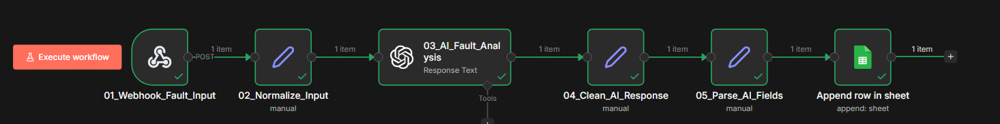
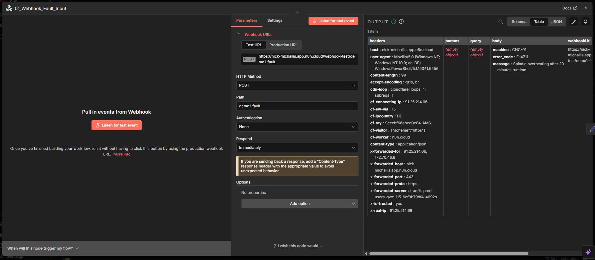
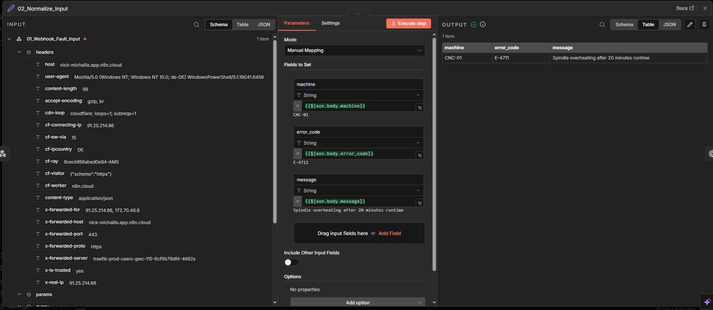
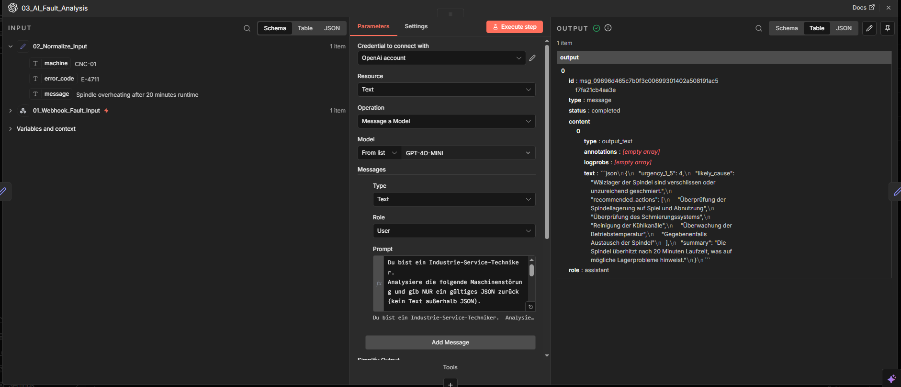
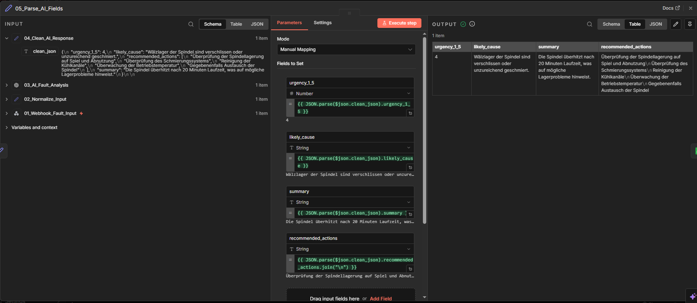
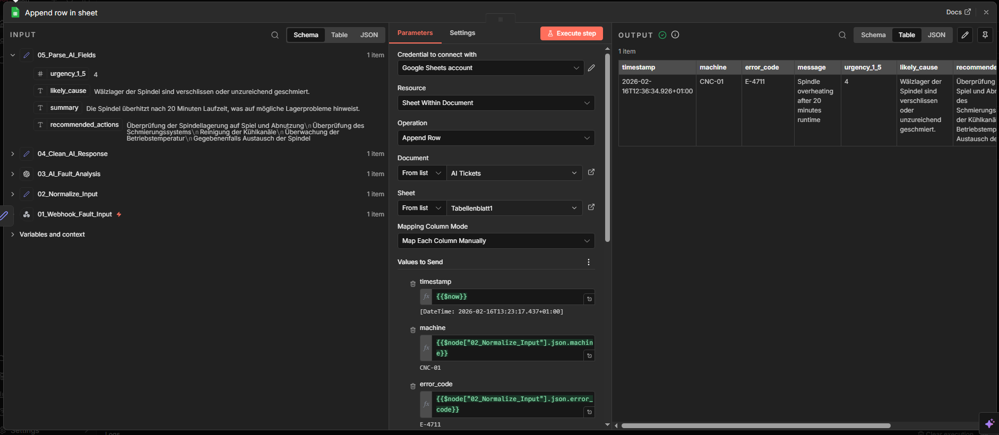
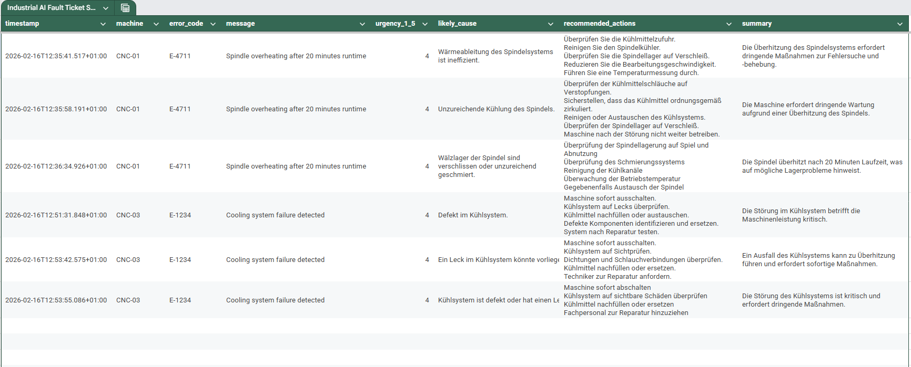
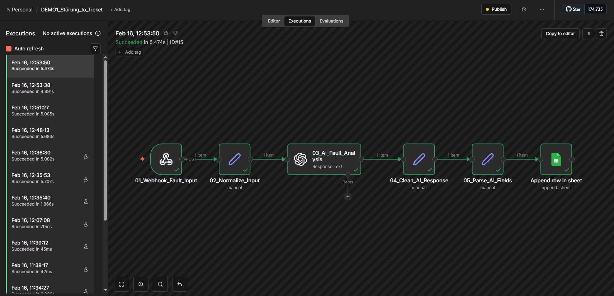

# ai-fault-triage-ticket-automation
AI-powered industrial fault triage &amp; automated ticket generation using n8n and OpenAI.
# 🚀 AI Fault Triage & Ticket Automation

An AI-powered industrial fault triage workflow built using **n8n** and **OpenAI**.

This project demonstrates how machine fault events can be automatically analyzed, classified, and converted into structured service tickets using LLM-based automation.

---

# 🧠 Overview

The system simulates a production-ready industrial automation pipeline designed to support first-level service diagnostics.

It receives machine fault events, performs AI-based analysis, and generates structured tickets for operational dashboards.

---

# 🏗 System Architecture

High-level overview of the complete n8n pipeline (end-to-end):

---

# ⚙️ Live Workflow (Step-by-Step)

## 01) Webhook Ingestion (Fault Event Input)

Incoming machine fault event is received via HTTP POST webhook.

---

## 02) Input Normalization

The payload is mapped into standardized fields (`machine`, `error_code`, `message`) for consistent downstream processing.

---

## 03) AI Fault Analysis (LLM)

OpenAI analyzes the fault and returns strictly structured JSON including:

- urgency_1_5
- likely_cause
- recommended_actions
- summary

---

## 04) Clean AI Response

The workflow removes markdown wrappers and formatting noise to ensure reliable JSON parsing.

---

## 05) Parse Structured Fields

The cleaned JSON is parsed into structured fields for storage and dashboard rendering.

---

## 06) Persist Ticket to Google Sheets

All fields are mapped and appended into a structured ticket dashboard.

---

## 07) Final Result – Ticket Dashboard

Structured service ticket including:

- Timestamp
- Machine
- Error Code
- Priority
- Root Cause
- Recommended Actions
- Summary

---

## 08) Execution Proof

Successful workflow execution in n8n.

---

# 💼 Business Impact

- Reduces manual triage workload  
- Standardizes first-level diagnostics  
- Improves response prioritization  
- Enables scalable AI-assisted service operations  

---

# 📈 Scalability Potential

This architecture can be extended to:

- ERP / MES system integration  
- Predictive maintenance models  
- Real-time shopfloor monitoring  
- Automated technician dispatch workflows  

---

# 🛠 Technology Stack

- n8n (workflow orchestration)  
- OpenAI API (LLM-based diagnostics)  
- Google Sheets (structured ticket dashboard)  
- Webhook-based real-time ingestion  

---

## 🔥 What This Demonstrates

- AI workflow orchestration  
- Structured LLM output enforcement  
- Production webhook deployment  
- Data transformation & parsing  
- End-to-end automation design  

